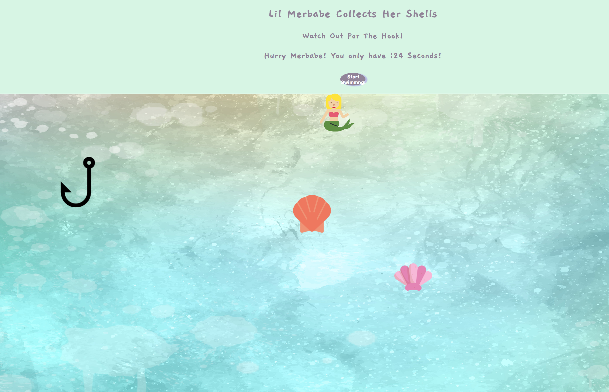

# Underwater Game!

Interactive animated game to chase shells and avoid the hook!

## URL Link - Best Played at 25% Zoom Out | Full Screen

http://combative-skate.surge.sh

## Screenshot

## Getting Started

Use the arrow keys to get Merbabe to move around in the water.  She hovers over shells to collect them and they disappear.  She avoids the hook.  

She wins if she collects all three shells before the 30 second timer stops at 0 and doesn't get the hook.

## Built With

Canvas
javascript
html
css
on chrome
jQuery

## Authors

* **Jessamyn McTwigan** - *Initial work* - [Jessamyn27](https://github.com/jessamyn27)

## Acknowledgments

* Hat tip to anyone whose code was used on Github and Stack Overflow
* Inspired by past Cohort examples from General Assembly
* Disneys "The Little Mermaid"
https://tenor.com/wLd1.gif

## Credits

* Background:
<a href="http://www.freepik.com">Designed by Sketchepedia / Freepik</a>

* Icons:
// All icons are licensed under Creative Commons (http://creativecommons.org/licenses/by/3.0/) and taken from FlatIcon (https://www.flaticon.com). Additional attributes are as following:

Mermaid, Shells, Hook, Skull = Icons made by FreePik (http://www.freepik.com).
